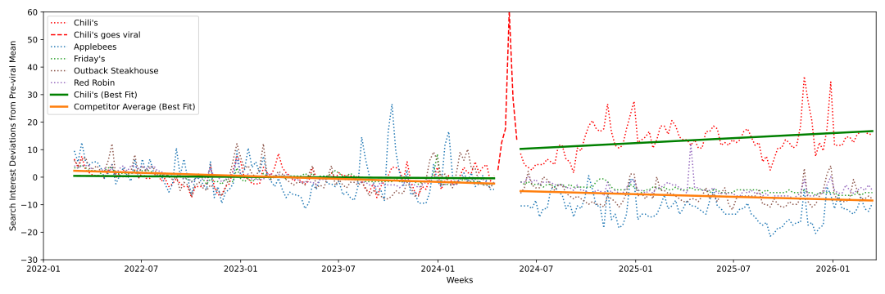
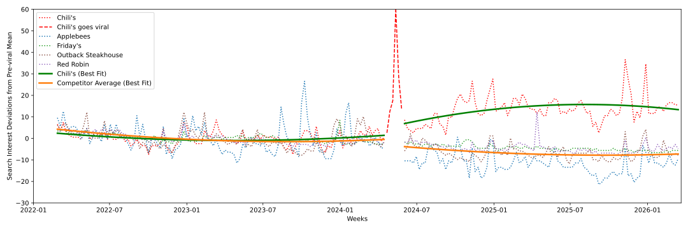
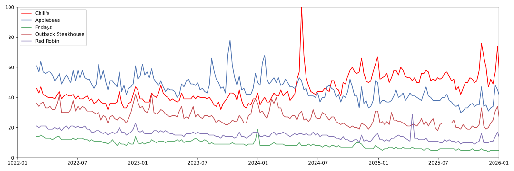
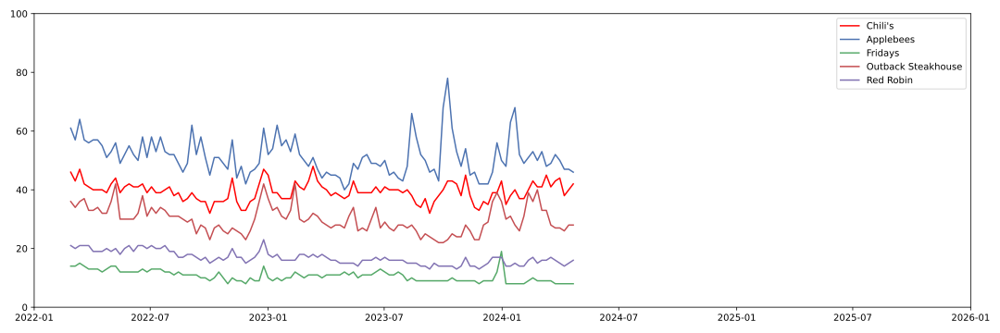
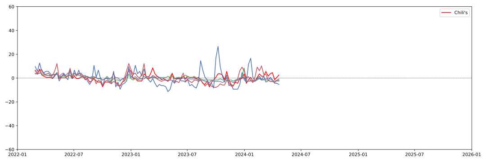
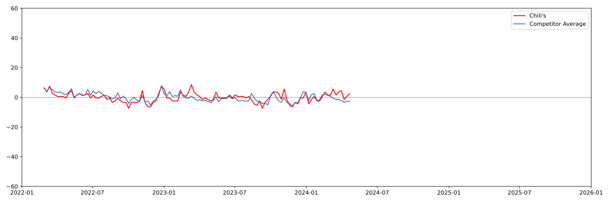

# Did TikTok Cause Chili’s Comeback?

Causal Inference

Chili's

Google Trends

TikTok

Chili’s Triple Dipper appetizer went viral on TikTok in April-May 2024 leading to a large jump in sales that quarter. In this blog I analyze whether that event had measurable long-lasting impacts on customer search interest in the restaurant.

Author

Isai Garcia-Baza

Published

April 2, 2026

Modified

April 2, 2026

For businesses, going viral (for the right reasons) can lead to huge benefits. Virality means more eyes on the product, the business, and most importantly, more sales. But these fifteen minutes of fame quickly fade. Products burst on the scene, enjoy a sharp rise in sales then drop back to baseline. There are however, a select few that are able to capitalize on their newfound fame capturing customer loyalty for the long-term. Today, I use Google Trends search data to analyze whether Chili’s was able to capitalize on its 2024 viral Triple Dipper, and if this moment lead to long-term benefits for the restaurant chain.

The short answer is that Chili’s viral TikTok moment gave way to statistically significant increases in overall search interest that kick-started an era of search growth that continues today. Combined, these two effects disrupted the status quo and helped the chain beat out Applebees for the No. 1 searched-for casual dining restaurant in my sample. Chili’s now dominates the search space, while competitors continue on a slow-but-steady decline.

Thank you for visiting. I sincerely hope you enjoy reading this blog as much as I enjoyed writing it. If you would like to connect, please contact me via [LinkedIn](https://www.linkedin.com/in/isaigarciabaza/) or email me using the address on [my website](https://isaigarciabaza.com/).

## Linear Time

Interrupted time series model with linear time trend.

## Quadratic Time

Interrupted time series model with quadratic time trend.

## Raw Data

Raw search interest data.

In April-May 2024 it seemed Chili’s was everywhere. The chain’s Triple Dipper was a viral hit on TikTok [(sample video from Nov. 2024)](https://www.tiktok.com/@mikaylanogueira/video/7433935033737661727?lang=en). Creators, influencers, and everyday people were pouring through Chili’s peppered doors to order the appetizer and record themselves doing the now-famous mozzarella cheese pull. By the end of the fiscal quarter, Chili’s was boasting [31.4 percent](https://www.fsrmagazine.com/operations/marketing-promotions/how-chilis-went-from-nostalgia-brand-to-viral-sensation/) same-store sales growth with 14 percent of all sales coming from the Triple Dipper. Yet, just one month prior and despite two years of trying to turn the company around, Chili’s seemed to be on the road to nowhere, unable to differentiate itself from competitors.

In this blog I walk you through how I use an interrupted time series model to estimate the long-term effects of this viral TikTok craze. I compare how Chili’s stacks up against rivals Applebees, T.G.I. Fridays, Outback Steakhouse, and Red Robin. These casual dining chains represent their main competition and serve as a useful barometer for the sector.

Using Google Trends search data, I capture real-time customer interest in these brands and show that the viral moment triggered statistically detectable increases in customer interest that propelled Chili’s to the the No. 1 searched restaurant of the group. Even as competitors continued on their downward trajectories, Chili’s increased its rate of climb. In plain English, search interest for Chili’s is now **higher** on average and **increasing** at a higher rate than before.

## Casual Dining 2022 through early 2024

Casual dining is a competitive and crowded space. With thin margins and a tightening economy, restaurants are continually jockeying for market share and customer loyalty. In this section I explore the casual-dining search landscape just prior to May 2024 and establish a baseline for my analysis. This period is critical for estimating a causal effect in quasi-experimental settings because it establishes a pattern of behavior that allows us to extrapolate into the future. This allows me to model business-as-usual and detect when observed behavior deviates from this norm.

Figure 1: Weekly search interest for Chili’s and a selection of competitors, 2022-2024.

Among the casual dining chains during this period, Applebees is the clear leader. It ranks no. 1 in search volume and boasts the largest spikes in interest (see [Figure 1](#fig-pretrend)). Chili’s ranks second, followed by Outback Steakhouse and Red Robin.

Although on the surface these trends appear largely flat during this period (see [Figure 2](#fig-pretrend-recentered)), regression analysis reveals that search interest in competitor chains was declining at an average weekly rate of -0.042 search units \\(\beta = -0.042, p\<0.001)\\ ([regression results](@sec-regression-results)). During this same period however, search interest for Chili’s was growing at an average weekly rate of 0.034 units \\(\beta = 0.034, p\<0.001)\\.

> **NOTE:**
>
> The plain language interpretation of these numbers is a bit confusing, so bear with me. Google Trends data are scaled relative to the peak search period, which receives a score of 100. A score of 50 means there were half as many searches as on the peak peak day.
>
> Now, to give concrete numbers: if Chili’s received 10,000,000 searches at the peak of virality, then during the pre-viral period, competitors were seeing average weekly declines of roughly -4,200 searches while Chili’s was seeing average weekly increases of roughly 3,400.

My regression model and visualizations help establish a few facts:

- First, search interest for these restaurants moves in tandem and is seasonal. For example, certain holidays cause peaks and valleys, with interest waning in the months of August-October of 2022 and 2023. What matters here is that no restaurant is immune to these shifts, and no restaurant appears overly sensitive to them.

- Second, the system is remarkably stable. There are only about two instances where restaurants change rank order before immediately correcting. Further with this amount of data, we can firmly establish the stability of these trajectories. These are unlikely to change, unless something fundamentally changes about customers’ tastes or behaviors.

[Figure 2](#fig-pretrend-recentered) and [Figure 3](#fig-mean-pretrend-recentered) make facts 1 and 2 clearer.

Figure 2: Mean-centered weekly search interest for Chili’s and a selection of competitors, 2022-2024.

Using these two years of data allows me to model business as usual. For two years these restaurants moved in near lock-step, largely following the same pattern of peaks and valleys. This suggests that the underlying mechanisms that drive customer behaviors are similar across these restaurants. No restaurant is immune or differentially affected by seasonal changes, and interest in these restaurants over time is mostly flat though diverging. Furthermore this stability over time implies this behavior should continue in May 2024 and beyond, unless some external force acts on them.

Figure 3: Mean-centered weekly search interest for Chili’s and the average of competitors, 2022-2024.

## Model Specification

To model customer search behavior and estimate causal effects of the Triple Dipper’s virality I turn to an interrupted time series model (background: [here](https://en.wikipedia.org/wiki/Interrupted_time_series), and [here](https://theeffectbook.net/ch-EventStudies.html)). This modeling approach allows me to fit intercepts and slopes that vary before and after the viral moment. By comparing slopes before and after I can estimate whether growth rate changed, and by comparing intercepts I can estimate whether there was a sizable and immediate jump in interest.

To determine whether there are differences in search interest between the two groups I use the following estimating equation:

\\ \begin{align} Y\_{it} = \beta_0 + &\beta_1 Treated\_{i} \\ + &\beta_2 Post\_{it} \\ + &\beta_3 WeeksCentered\_{t} \\ + &\beta_4 (Treated\_{i} \times WeeksCentered\_{t}) \\ + &\beta_5 (Treated\_{i} \times Post\_{it}) \\ + &\beta_6 (Post\_{it} \times WeeksCentered\_{t}) \\ + &\beta_7 (Post\_{it} \times WeeksCentered\_{t} \times Treated\_{i}) \\ + &\gamma\_{i} \\ + &\epsilon\_{it} \end{align} \tag{1}\\

> **NOTE:**
>
> I also estimate models with \\WeeksCentered\_{t}^2\\ and corresponding interaction terms. Ultimately I opted to focus on the linear time specification because it is easier to interpret and it answers my fundamental question of average effects in the post period. Nevertheless I still include quadratic results in tables, figures, and in call-out sections like this for the curious.

where:

- \\\beta_0\\ is the intercept at \\WeeksCentered = 0\\ using variation from the pre-period.
- \\\beta_1\\ is the pre-trend intercept shift for Chili’s.
- \\\beta_2\\ is the average intercept shift for competitors in the period after Chili’s went viral.
- \\\beta_3\\ is the linear effect of time during the pre-period for competitors. This estimate is the weekly average change in competitor search interest.
- \\\beta_4\\ is the linear effect of time during the pre-period for Chili’s. It is an estimate of the weekly average change in Chili’s search interest.
- \\\beta_5\\ corresponds to the immediate intercept shift for Chili’s in the post period. This term estimates whether there was an immediate and discontinuous jump in search interest using variation from the post-period.
- \\\beta_6\\ captures any changes in slope for competitors after Chili’s went viral. A value of 0 would indicate there was no change in customer behavior during the post-viral period.
- \\\beta_7\\ captures changes in slope for Chili’s search interest. A value different from 0 would indicate that going viral changed the rate at which people searched for Chili’s.
- \\\gamma\_{i}\\ are unit-level fixed effects that capture time-invariant differences among restaurants. This term controls for stable differences like the fact that Red Robin is primarily a burger restaurant and Outback Steakhouse focuses on steaks. Differences in baseline US tastes for burgers and steaks would be captured by this term.
- \\\epsilon\_{it}\\ is an error term representing variation not explained by the model.

This model allows me to flexibly fit intercepts and slopes for Chili’s and its competitors in both pre and post-viral periods. I then compare whether these values are the statistically the same or if they are different.

## Results

I’m interested in the following questions and statistical comparisons:

> For full regression results skip to: [Regression Table](@sec-regression-results).

***Did the viral Triple Dipper change *Chili’s* average weekly search growth?*** A resounding yes! According to the linear-time model, the growth rate for customer search interest in Chili’s increased by 0.0724 search units \\(\beta = 0.0724, p\<0.001)\\, a twofold increase over and above its previous growth rate of \\(\beta = 0.034, p\<0.001)\\. In total, Chili’s post-viral growth rate was an average of 10640 search units per week.

***Did the viral Triple Dipper cause a discontinuous jump in search interest for *Chili’s*?*** Once again, yes! The linear-time model estimates an immediate jump of 12.953 search units \\(\beta = 12.953, p\<0.001)\\.

***Did the viral Triple Dipper change *competitor* average weekly search growth?*** No. The estimated growth rate for competitors is not statistically different from zero in the post period \\(\beta = 0.0051, p\>0.05)\\ meaning it is no different from its pre-period slope of -0.042 \\(\beta = -0.042, p\<0.001)\\.

***Did the viral Triple Dipper cause a discontinuous jump in search interest for *competitors*?*** No. There is no statistically detectable discontinuous jump in average competitor search interest in the post-viral period \\(\beta = -2.4453, p\>0.05)\\.

> **NOTE:**
>
> Estimates from the quadratic-time model show slightly different but interesting results. By including quadratic terms I allow slopes to accelerate or decelerate over time. This allows me to estimate cases where growth changes over time such as when growth starts strong but wanes as time goes on.
>
> Using the quadratic model, Chili’s pre-viral search growth was flat \\(\beta = 0.033, p\>0.05)\\ with no acceleration \\(\beta = -0.0, p\>0.05)\\. Similarly, competitors saw flat search growth \\(\beta = 0.069, p\>0.05)\\ during the pre-viral period but had statistically detectable acceleration over time \\(\beta = 0.0009, p\<0.01)\\.
>
> Chili’s post-viral growth rate is an aggressive 0.3928 units \\(\beta = 0.3928, p\<0.001)\\ with a small deceleration of -0.0032 \\(\beta = -0.0032, p\<0.001)\\ units per week from the quadratic time term. Assuming peak virality of 10,000,000 searches, this represents a growth of 39,280 per week!
>
> Chili’s post-viral discontinuous jump is a more modest 7.4448 \\(\beta = 7.4448, p\<0.001)\\.
>
> Competitor post-viral growth rate decreases by an additional -0.1906 \\(\beta = -0.1906, p\<0.01)\\ no change in slope over time from the quadratic term \\(\beta = -0.0001, p\>0.05)\\. Combined, during the post-viral period competitor search interest declines at a rate of -0.1906 units but has a weekly acceleration of 0.0009. According to this model, with enough time growth rate should reverse to the positive direction.
>
> There was no detectable post-viral jump in search interest for competitors \\(\beta = -3.2534, p\>0.05)\\.

### But what does it all mean?

These results very clearly point to TikTok’s role in setting off Chili’s turn-around. Its virality on the platform in April 2024 set off a tidal wave of search interest. Chili’s capitalized on this attention and was able to capture it long-term. Customers remain interested in the restaurant and search interest continues to grow. Chili’s is well on its way to solidifying its position as the top casual dining chain in the US for the long term.

## Linear

Linear Time Trend.

## Quadratic

Quadratic Time Trend.

Its competitors however, remain in decline. They did not see significant changes in their own trajectories further confirming TikTok’s role in driving customers to Chili’s. This is because their stability over time suggests external economic forces and customer tastes remained stable while Chili’s went viral. There was no sudden rush across the board toward casual dining chains which rules out alternative causes like changes in what Americans like to eat or economic pressures.

Lastly, Chili’s growth did not appear to hurt competitors. Their trajectories remained stable, which is good news in the sense that they aren’t being cannibalized, but it suggests they have some work to do to avoid a slow decline into irrelevance. I don’t want to overstate this conclusion however, as it is very easy for customers to search for all of these restaurants while only eating at one. Financial, point-of-sale, or geolocation data would better answer this type of question.

Thank you for reading! In future blogs I will explore alternative explanations for Chili’s turn around and analyze financial returns.

### Regression Table

|  |  |  |
|----|----|----|
|  |  |  |
|  | *Dependent variable: search_interest* |  |
|  |  |  |
|  | Linear Time | Quadratic Time |
|  | \(1\) | \(2\) |
|  |  |  |
| treated | -3.838^(\*\*\*) | -3.849^(\*\*\*) |
|  | (0.423) | (0.728) |
| post | -2.445 | -3.253 |
|  | (1.610) | (1.949) |
| weeks_centered | -0.042^(\*\*\*) | 0.069 |
|  | (0.003) | (0.036) |
| weeks_centered2 |  | 0.001^(\*\*) |
|  |  | (0.000) |
| treated:weeks_centered | 0.034^(\*\*\*) | 0.033 |
|  | (0.003) | (0.036) |
| treated:weeks_centered2 |  | -0.000 |
|  |  | (0.000) |
| treated:post | 12.953^(\*\*\*) | 7.445^(\*\*\*) |
|  | (1.610) | (1.949) |
| post:weeks_centered | 0.005 | -0.191^(\*\*) |
|  | (0.007) | (0.060) |
| post:weeks_centered2 |  | -0.000 |
|  |  | (0.000) |
| post:weeks_centered:treated | 0.072^(\*\*\*) | 0.393^(\*\*\*) |
|  | (0.007) | (0.060) |
| post:weeks_centered2:treated |  | -0.003^(\*\*\*) |
|  |  | (0.000) |
| Unit Fixed Effect | Yes | Yes |
|  |  |  |
| Observations | 1035 | 1035 |
| R² | 0.941 | 0.944 |
| Adjusted R² | 0.940 | 0.943 |
| Residual Std. Error | 4.032 (df=1024) | 3.942 (df=1020) |
| F Statistic | 347.966^(\*\*\*) (df=10; 1024) | 689.290^(\*\*\*) (df=14; 1020) |
|  |  |  |
| Note: | ^(\*)p\<0.05; ^(\*\*)p\<0.01; ^(\*\*\*)p\<0.001 |  |
